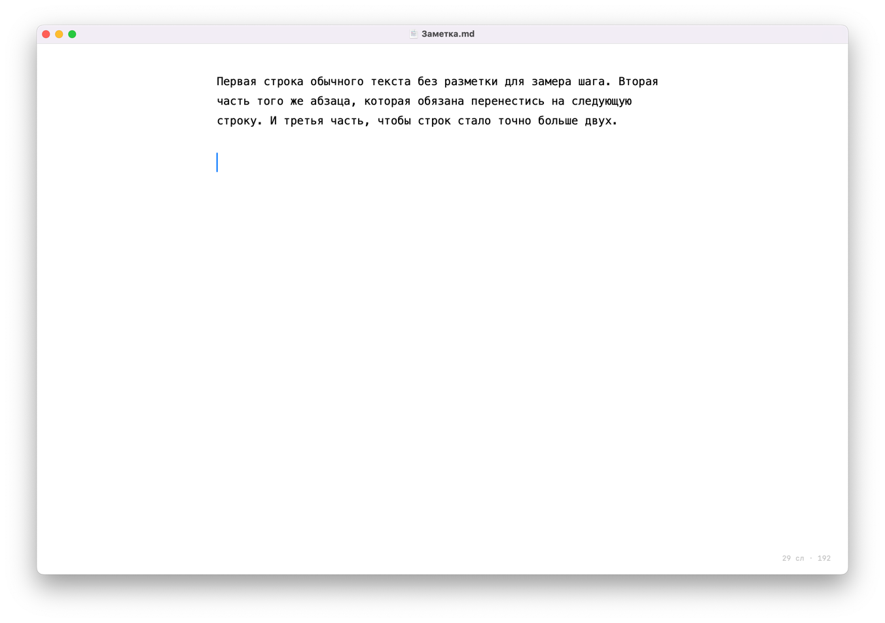

# Nib


-lightgrey)


Минималистичный редактор Markdown для macOS.
Открыть файл, поправить, сохранить, закрыть.



## Зачем это

Мне не нравился ни один Markdown-редактор на моём компьютере. Все они казались
громоздкими и некрасивыми: файловые деревья, вкладки, панели превью, тулбары,
настройки в четыре уровня вложенности. Часть из них ещё и открывается ощутимо
долго - а мне нужно просто прочитать заметку и поправить пару строк.

Хорошие варианты в интернете есть, но стоят дорого для инструмента,
от которого мне нужна одна функция: показать текст красиво и дать его отредактировать.

Так появился Nib. Задача была ровно одна — приложение, которое:

- открывает `.md` файл и сохраняет его,
- выглядит спокойно и лаконично, ничего лишнего на экране,
- запускается моментально,
- не требует ни проектов, ни воркспейсов, ни папок-хранилищ.

Никакого управления файлами, никакой синхронизации, никаких плагинов. 
Файл - текст - сохранить.

## Что внутри

- Открытие и сохранение `.md` через нативные диалоги, `⌘O` / `⌘S`, полноценный undo.
- Затухающий синтаксис: `**`, `#`, `[]()` гаснут до серого, содержимое остаётся
  контрастным. Отдельной панели превью нет — она не нужна, разметка читается прямо в тексте.
- Центрированная колонка фиксированной ширины, line-height 1.5.
- Светлая и тёмная тема. По умолчанию следует за системой, но в меню `View` →
  `Оформление` можно зафиксировать светлую или тёмную независимо от macOS.
- Прозрачный тайтлбар, тулбара нет. Счётчик слов — бледной капсулой в углу.
- Подстановка «умных» кавычек и тире отключена (иначе Markdown ломается).

### Горячие клавиши

| Клавиши | Действие |
|---|---|
| `⌘O` / `⌘S` | открыть / сохранить |
| `⌘F` | нативный find bar |
| `⌘+` / `⌘-` / `⌘0` | размер шрифта |
| `⌥⌘]` / `⌥⌘[` | ширина колонки |

Размер шрифта и ширина колонки запоминаются между запусками.

## Требования

- macOS 13.0 Ventura или новее
- Apple Silicon или Intel — в релизе лежит universal binary

| macOS | Статус |
|---|---|
| 26 Tahoe, 15 Sequoia | должно работать, не проверялось |
| 14 Sonoma | проверено |
| 13 Ventura | минимальная поддерживаемая версия |
| 12 Monterey и старше | не поддерживается |

## Установка

1. Скачайте `.dmg` из [Releases](https://github.com/helpsolution/nib/releases/latest).
2. Откройте образ и перетащите **Nib** в `Applications`.
3. Снимите карантин Gatekeeper — приложение подписано ad-hoc-подписью и не
   нотаризовано в Apple, поэтому macOS блокирует его после скачивания:

   ```bash
   xattr -dr com.apple.quarantine /Applications/Nib.app
   ```

   Без этой команды при первом запуске вы увидите «Nib повреждён» или
   «не удаётся проверить разработчика». Это цена распространения без платного
   Apple Developer-аккаунта, а не признак проблемы с файлом. Кто не хочет
   выполнять команду — [собирайте из исходников](#сборка-из-исходников):
   локальная сборка карантина не получает.

### Сделать редактором по умолчанию

Правый клик на `.md` → Get Info → Open with → Nib → Change All.

## Сборка из исходников

```bash
xcode-select --install          # если ещё нет Command Line Tools
git clone https://github.com/helpsolution/nib.git
cd nib
./build.sh
```

На выходе — `build/Nib.app` и `build/Nib-<версия>.dmg`. Скрипт компилирует обе
архитектуры, склеивает их через `lipo`, собирает иконку из `icon_1024.png` и
подписывает бандл ad-hoc-подписью (`codesign --sign -`). На Apple Silicon подпись
обязательна: неподписанный arm64-бинарник не запустится.

Xcode-проекта нет и не планируется — весь код в `Sources/`, сборка идёт напрямую
через `swiftc`. Файлы по ответственностям:

| Файл | Что внутри |
|------|------------|
| `Sources/NibApp.swift` | Точка входа, `DocumentGroup`, пункты меню |
| `Sources/EditorScreen.swift` | Окно, счётчик слов, хромировка, масштаб |
| `Sources/Editor.swift` | `NSTextView` с центрированной колонкой и мост в SwiftUI |
| `Sources/Highlighter.swift` | Регулярки и раскраска разметки |
| `Sources/MarkdownDocument.swift` | Чтение и запись файла, определение кодировки |
| `Sources/Typo.swift` | Подбор шрифта, абзацный стиль |
| `Sources/Prefs.swift` | Размер шрифта и ширина колонки в `UserDefaults` |

`build.sh` подхватывает `Sources/*.swift` по маске — новый файл достаточно просто
положить в папку.

## Тесты

```bash
./test.sh
```

Зависимостей нет и здесь: скрипт компилирует `swiftc`-ом всё, кроме `NibApp.swift`
(там `@main`, он конфликтует с точкой входа тестов), вместе с `Tests/*.swift` и
запускает получившийся бинарник. Ни SwiftPM, ни XCTest, ни Xcode-проекта.

192 проверки. Что покрыто:

| Проверка | Зачем |
|---|---|
| Якорь типографики | кегли заголовков и производные от кегля сравниваются по `bitPattern`, а не с допуском |
| Правила подсветки | заголовки, разметка, ссылки, списки, цитаты, код |
| Что разметкой быть не должно | `2 * 3`, `snake_case`, незакрытый `**` |
| Инкрементальный проход равен полному | подсветка после правки обязана совпадать с подсветкой с нуля |
| Кодировки | открыл и сохранил без правок — те же байты; UTF-8, UTF-16, CP1251, KOI8-R, MacRoman |
| Отказ вместо порчи | двоичный мусор и обрезанный UTF-8 не превращаются в `U+FFFD` |
| Ритм строки | межстрочный интервал задаёт высоту каретки — цифры тут не косметика |
| Настройки | чистый `UserDefaults` даёт кегль 17 и колонку 700, а не нули |
| Геометрия колонки | поля не уходят в минус, текст не уезжает за правый край |
| Счётчик слов | пробелы, табы, переводы строки, эмодзи |
| Вырожденный ввод | пустой документ, одинокая решётка, незакрытый блок кода, правка за границей текста |

Тесты адресуются к примерам по содержимому, а не по числовым позициям: иначе
правка примера ломает половину проверок.

### Почему якорь сравнивает биты

Первая попытка рефакторинга (`af0ff8c`) была откачена: после неё изменилось
поведение переноса строки. Замерами разницу воспроизвести не удалось, и работу
вернули к состоянию 1.1.1 целиком.

Причина нашлась позже. Рефакторинг переписал `1.0 + (0.30 - 0.04 * n)` в
`1 + 0.30 - 0.04 * n`. Сложение во float не ассоциативно: кегли заголовков
h4 и h5 уехали на 1 ULP — 20.06 против 20.060000000000002. Другой `pointSize` —
другие метрики глифов. Сравнение с допуском такую разницу пропускает, поэтому
`Tests/MetricsAnchorTests.swift` сверяет `bitPattern`.

Отсюда правило: **порядок операций в формулах типографики не переставлять.**
В `Typo.Metrics` и `Typo.heading` об этом висит предупреждение.

### Известные дефекты

Шесть проверок помечены `Check.knownBug` — это описанное поведение, которое пока
неверно. Прогон от них не краснеет, но и забыть про них нельзя: как только дефект
исправят, проверка **упадёт** с требованием снять маркер.

| Дефект | Откуда |
|---|---|
| Разметка внутри ``` красится как разметка: `**`, `-`, ссылки, отбивка заголовка | откат `af0ff8c`, фикс лежит в ветке `refactoring-tests` (`4b2b71b`) |
| Снос закрывающей ``` не перекрашивает бывший блок | там же |
| UTF-16 BE при сохранении переворачивается в LE | не чинилось: `decode` отдаёт обобщённый `.utf16`, запись всегда даёт LE + BOM |

## Шрифт

Приложение перебирает моноширинные шрифты из списка `Typo.preferred` в `Sources/Typo.swift`
и берёт первый установленный в системе. Если ни одного нет — используется системный
моноширинный (SF Mono). Хотите другой шрифт — допишите его имя в начало списка
и пересоберите.

## Что можно докрутить

- Typewriter scrolling — каретка удерживается по центру.
- Focus mode: гасить все абзацы, кроме текущего (~30 строк через
  `NSLayoutManager.temporaryAttributes`).
- Экспорт в PDF/HTML: PDF — через `NSPrintOperation`, HTML потребует парсер.

## Лицензия

[MIT](LICENSE).
